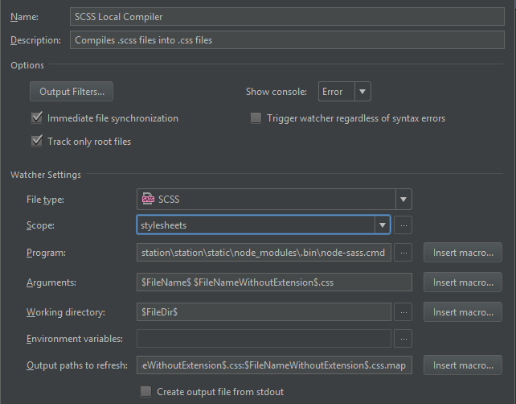

# billstation
web based bill sharing app - also serves as an experimental playground

currently uses Django 1.10 + Angular 2

## Development

### Getting started
- download Python 3.5+
- download node (6+) + npm (3+)
- checkout this project
- install virtualenv: `pip install virtualenv`
- create virtualenv: `py -m virtualenv venvBillstation` in your local vEnv-folder
- activate virtualenv: `venvBillstation\Scripts\activate.bat`
- install python packages: `pip install -r requires.txt` at project root
- download JS dependencies: `cd station/static` & `npm install`
- setup local DB: `python manage.py migrate` at project root
- run local server: `python manage.py runserver localhost:8000`

### Webstorm - Sass compiler setup

- Open Watcher settings: `File` - `Settings` - Search for `File Watchers`
- Add a new watcher and use a new local scope with the following pattern `file[billstation]:station/static/css/*`)
- Then configure the rest of the watcher as follows:
  
  